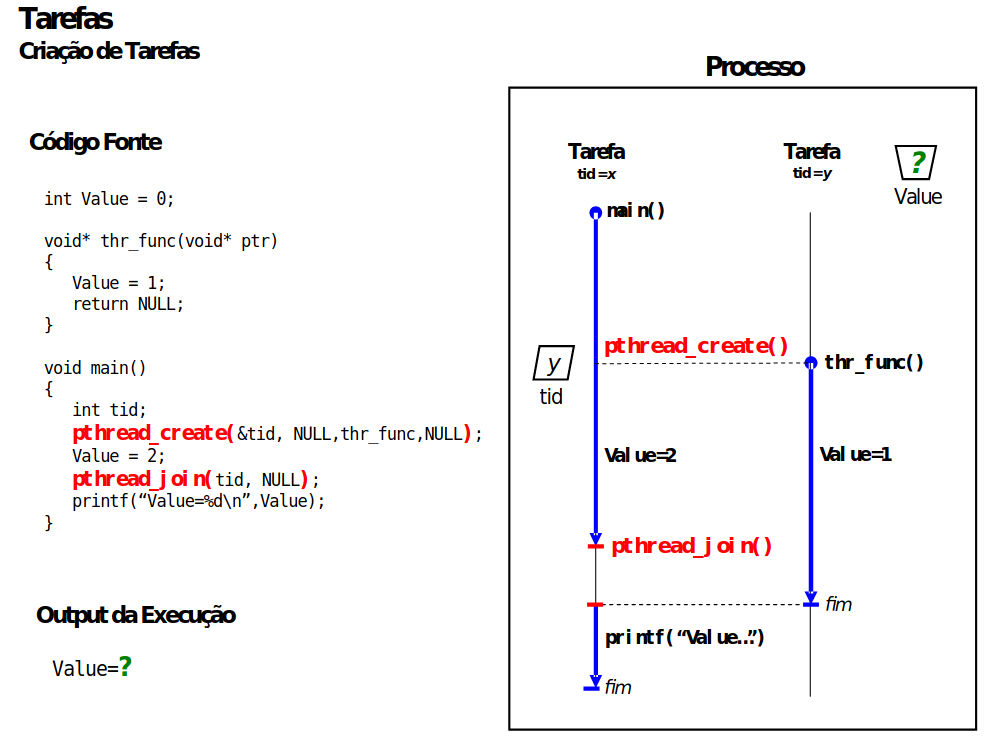

# Guião Programação com processos e tarefas

  

## Objectivos

*Nota: Os tutoriais práticos de SO consistem num conjunto de exercícios práticos que permitem aos alunos
familiarizarem-se com um determinado tema que será necessário para resolver os projetos da disciplina.
Os tutoriais podem ser resolvidos individualmente ou em grupo. A sua resolução é recomendada mas
não obrigatória. Não são avaliados.
Cada tutorial pressupõe que os exercícios são realizados numa interface de linha de comandos (shell) de
um sistema Unix/Linux ou equivalente. Assume também que os alunos já resolveram os tutoriais
anteriores.*

No final deste guião, deverá ser capaz de:

- Estar familiarizado com programação paralela com tarefas (que
é um dos requisitos essenciais do 1º exercício do projeto de SO)
- Estar familiarizado com programação paralela com processos

## 1. Tarefas

Clone este repositório, usando o git: `git clone git@github.com:tecnico-so/lab_programacao-processos-tarefas`.

Aceda à diretoria com o comando:

```sh
cd lab_programacao-processos-tarefas
```

Descomprima o conteúdo do ficheiro thread.zip com o seguinte comando:

```sh
unzip thread.zip
```

a) Estude, compile e execute a aplicação. Consulte o diagrama na página seguinte deste guião e
compreenda o resultado do programa.

b) Por que razão é indeterminado o conteúdo da variável global Value?

c) Monte uma experiência que prove a afirmação da alínea b). Sugestão: utilize a chamada sistema
sleep.

## 2. Processos

Componha um programa paralelo alternativo, em que as chamadas a pthread_create e pthread_join
são substituídas por chamadas a fork e wait (tenha o cuidado de assegurar que a função wait só é
chamada pelo processo pai).

a) Neste caso, o paralelismo acontecerá com processos distintos, e não com tarefas dentro do mesmo
processo. O que muda no resultado que este novo programa imprime no stdout?


